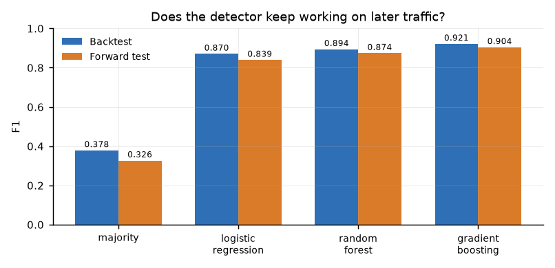
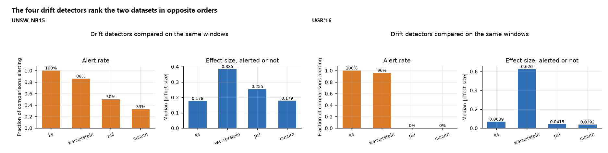

# DriftGuard

**Reliable Network Anomaly Detection Under Distribution Shift**

Does a machine-learning network anomaly detector trained on historical traffic
continue to detect attacks reliably when evaluated on later, previously unseen
traffic?

A student project. Every number below is read from a recorded experiment
directory in `results/experiments/` and rendered from those files, not typed
in. The technical report is `docs/project_report.pdf`.

---

## 1. Project overview

DriftGuard measures how far a network intrusion detector degrades when the
traffic it was trained on is replaced by later traffic, and tests whether
drift detection or retraining recovers any of the loss. It is a measurement
project, not a new algorithm: the models are ordinary baselines on purpose, so
that whatever the numbers show belongs to the data rather than to a cleverer
classifier.

The short answer from the two datasets evaluated here is that behaviour is not
stable across them. Every model lost F1 on later traffic on both. But which
adaptation strategy helps, and which drift detector notices, reverses between
them. That is the finding, and the project does not average it away.

| | UNSW-NB15 | UGR'16 |
|---|---|---|
| Rows | 2,540,047 | 8,817,287 |
| Train / validation / backtest / forward | 1,270,025 / 381,021 / 380,999 / 508,002 | 4,409,934 / 1,322,041 / 1,322,061 / 1,763,251 |
| Forward period | 2015-02-18, ~4 hours | 2016-08-08 to 2016-08-15, 7 days |
| Forward attack rate | 19.507% | 0.811% |
| Best forward F1 | 0.9041 (gradient boosting) | 0.0259 (gradient boosting) |

## 2. Research question

**Primary.** Does a machine-learning network anomaly detector trained on
historical traffic continue to detect attacks reliably when evaluated on later,
previously unseen traffic?

**Secondary.** Which drift-detection and adaptation methods recover
performance most effectively under a fixed false-positive budget?

Neither question changed during the project.

## 3. Why I chose this question

I started with the simpler question of whether network traffic metadata
contains enough information to distinguish normal traffic from attacks.
Existing research then led me to a harder problem: network traffic changes over
time, and machine-learning intrusion detectors may face concept drift and
feature drift.

Research on temporal network intrusion detection and the UGR'16 dataset was
especially useful for developing this direction.

Based on this research, I formulated the next question for this project:

> Does a machine-learning network anomaly detector trained on historical traffic
> continue to detect attacks reliably when evaluated on later, previously unseen
> traffic?

**The literature motivated the problem. The exact research question and
experiment design are my own.** The specific question, the four-period temporal
protocol, the fixed false-positive budget, and the decision to report
adaptation results with their cost beside them are this project's formulation.
They are not attributed to the papers cited, and no claim is made that a
published paper asked this question.

## 4. Research motivation

Shyaa et al. (2024) survey concept-drift and feature-dynamics-aware machine and
deep learning for intrusion detection, and give the premise: a detector trained
on one traffic distribution meets a different one in operation, and the
resulting drift is a first-class problem rather than a deployment detail.

Macia-Fernandez et al. (2018) introduce UGR'16, whose stated purpose is
evaluating intrusion detection systems that account for long-term traffic
evolution and periodicity, from a real ISP over several months. That is the
dataset design this project's temporal evaluation follows.

Xu et al. (2024) address drift detection, interpretation and adaptation
together; Yang et al. (2025) propose self-supervised adaptation to concept
drift for network intrusion detection. Both establish adaptation under drift as
an active problem with known partial solutions, which is why several
strategies are evaluated here rather than one assumed in advance.

Full citations are in the report's References section.

## 5. Threat model

* The defender observes **flow metadata only**: start time, duration, packet and
  byte counts, protocol and TCP flags. Payload contents are never inspected.
* The attacker generates malicious traffic and may encrypt, obfuscate or
  imitate legitimate flows.
* The environment changes independently of any attack: new software, new
  services, different traffic mixes. **This non-stationarity, not the
  attacker, is what the forward test measures.**
* The forward period is assumed to contain attacks the defender has not seen.
  Detection must not depend on prior knowledge of the specific attack.

Out of scope, and not tested or claimed: an adaptive attacker who knows the
detector's features, a compromised capture point, label poisoning in the
training data.

## 6. Architecture

```
data/registry.py       adapters -> one shared FlowFrame schema
features/preprocess.py metadata-only features, fitted on train rows only
temporal.py            contiguous, disjoint train/validation/backtest/forward split
drift/                 KS, Wasserstein, PSI, CUSUM
adaptation/            5 strategies under one false-positive budget
shift/                 8 controlled shift families, measured not assumed
experiments/           immutable run directories, every stage verified
evaluation/            metrics, calibration, failure analysis
reporting/             figures, PDF report, README results block
tools/                 verify_run.py, analyse_run.py, index_runs.py
```

Raw datasets live **outside** the repository, in a directory the pipeline
reads through an environment variable, and every run records the checksum of
each file it read.

## 7. Datasets

### UNSW-NB15

Labelled flow records with attack categories, captured over three sessions in
January and February 2015, read from a timestamp-preserving mirror. 2,540,047
rows. Attack rate 4.202% in the training period and 19.507% in the forward
period.

**Its time axis is the main limitation.** The recorded timestamps span 27 days
and the forward period covers roughly four hours, so this is a *relative*
temporal comparison and cannot support a long-horizon claim. One capture day
(2015-01-23) contains no attacks at all.

### The UGR'16 subset, exactly

Netflow records from a Greek ISP network, published as 23 weekly archives
totalling 215 GB. **The full release was not downloaded.** The subset used is
the documented week list recorded in the adapter:

* Calibration weeks, background only, never used for training: `march_week3`,
  `may_week1`
* Weeks carrying the temporal experiment: `july_week5`, `august_week1`,
  `august_week2`, `august_week3`
* Temporal span: 2016-03-18 to 2016-08-15

Six archive checksums are recorded in the run metadata. 8,817,287 rows across
four strictly chronological, disjoint periods. UGR'16 is the **stronger of the
two temporal experiments** here, because its forward period is a full week of
later traffic rather than four hours.

**The row cap is stated, not hidden.** Archives are thinned to a maximum of
1,500,000 rows per file, and the cap is recorded in the run metadata so the
exact sample is reproducible. A full-size attempt at 4,000,000 rows per archive
exceeded the 31.8 GB of available RAM and was abandoned. No claim is made about
the weeks that were not downloaded, or about the rows that were thinned out of
the weeks that were.

## 8. Temporal evaluation

Four contiguous, disjoint periods, split by **row quantile within timestamp
order** so a single timestamp is never divided across a boundary:

| Period | Role |
|---|---|
| train | fit the model and the preprocessor |
| validation | choose the operating threshold, once |
| backtest | held out, but inside the historical distribution |
| forward | later traffic the model has never seen |

Each model is fitted on train, evaluated twice — on backtest and on forward —
and the threshold is frozen after validation and never re-tuned per period.

## 9. Leakage prevention

Five guards, each covered by a test that fails if the guard is removed:

1. Periods are contiguous, ordered and disjoint. An identical timestamp is
   never split across a boundary, because UNSW-NB15 stamps many rows with the
   same second.
2. No row later than the forward start enters training.
3. The preprocessor, including the one-hot encoder for protocol, is fitted on
   training rows only. An encoder fitted across all periods would let a
   protocol label appearing only later define a feature dimension.
4. Scalers and thresholds are fitted on historical data only.
5. Adaptation strategies may use only rows timestamped strictly before the
   forward period, and this is asserted per strategy rather than assumed.

## 10. Models

Four deliberately ordinary baselines, all four run on both datasets:

| Model | Why it is here |
|---|---|
| `majority` | the floor. Predicting "attack" always. Its F1 is the prevalence, and it is included so no other number can be mistaken for skill |
| `logistic_regression` | the linear baseline, most sensitive to a shifted feature scale |
| `random_forest` | non-linear, robust, and the workhorse of the ablations |
| `gradient_boosting` | strongest of the four on both datasets |

Feature policy is metadata only: no payload bytes, no IP addresses, no ports,
no raw timestamps, no labels.

## 11. Drift detection

Four detectors, each on the same windows and the same features:

| Method | What it actually asks |
|---|---|
| **KS** | do the two samples come from the same distribution? |
| **Wasserstein** | how far must this data be moved to match the reference, scaled by its spread? |
| **PSI** | how much of the reference's mass has moved out of its bins? |
| **CUSUM** | has the running mean wandered far enough from the reference to matter? |

An alert requires **an effect size and a significance threshold together**. A
p-value alone is never treated as an alert: across hundreds of comparisons a
nominal threshold fires almost everywhere, which measures the number of
comparisons rather than the traffic.

CUSUM is calibrated against its own null distribution, so its false-alarm rate
is a configured property rather than an accident of the data.

Measured alert rates on the two completed runs:

| Method | UNSW-NB15 (of 64 comparisons) | UGR'16 (of 24 comparisons) |
|---|---|---|
| KS | 64 (100.0%) | 24 (100.0%) |
| Wasserstein | 55 (85.9%) | 23 (95.8%) |
| PSI | 32 (50.0%) | 0 (0.0%) |
| CUSUM | 21 (32.8%) | 0 (0.0%) |

UNSW-NB15 compares 4 windows x 16 features x 4 methods = 256 rows; UGR'16
compares 3 windows x 8 features x 4 methods = 96. Per window-and-feature pair
(64 on UNSW, 24 on UGR), the four methods agreed unanimously on 12 of 64 and
split on 52, with 0 pairs where all four stayed silent. On UGR'16 the four
methods split on every one of the 24 pairs.

**The two datasets rank the detectors differently.** PSI fires on half of UNSW's
comparisons and none of UGR's; CUSUM fires on a third of UNSW's and none of
UGR's. The smallest p-value on either dataset is below 5e-324, which is the
arithmetic consequence of comparing 256 samples rather than a finding about the
traffic, and is exactly why the alert rule requires an effect size as well.

## 12. Adaptation strategies

Five strategies, each judged on what it recovers **and what it costs**, under
the same false-positive budget as the unadapted baseline:

| Strategy | What it does |
|---|---|
| `none` | the baseline, unchanged |
| `threshold_recalibration` | re-pick the threshold from recent historical scores |
| `recent_window_retrain` | refit once on a recent window |
| `rolling_window_retrain` | refit repeatedly as the forward period advances, on a schedule |
| `historical_plus_recent_retrain` | refit on the full history plus the recent window |

`rolling_window_retrain` is genuinely rolling: it re-fits at a fixed cadence
rather than taking one snapshot. The first completed run of this project showed
`recent_window_retrain` and `rolling_window_retrain` producing byte-identical
results, which was a bug — the rolling strategy was not re-fitting — and it is
fixed, with `refits` and `training_seconds` recorded per strategy so the
difference is visible in the artifacts.

**One thing the reader should know before reading the tables below:** on both
datasets, `rolling_window_retrain` records `refits: 1`, not the several refits
its name implies. The forward periods are short enough — about 4 hours on
UNSW-NB15, 7 days on UGR'16 — that the configured refit cadence fires once.
So the two strategies differ in *which* rows they train on, not in how many
times they retrain, and the rolling result below should be read as a
single-refit-on-recent-history result. Raising the forward horizon, not the
cadence, is what would make rolling genuinely iterative.

## 13. Main UNSW-NB15 results

Backtest to forward, 4 models, F1 at the validation-derived threshold:

| Model | Backtest F1 | Forward F1 | F1 degradation | Forward recall | Forward FPR |
|---|---|---|---|---|---|
| majority | 0.3784 | 0.3265 | +0.0519 | 1.0000 | 1.0000 |
| logistic_regression | 0.8704 | 0.8392 | +0.0312 | 0.9021 | 0.0600 |
| random_forest | 0.8940 | 0.8736 | +0.0204 | 0.9999 | 0.0701 |
| gradient_boosting | 0.9213 | 0.9041 | +0.0172 | 0.9962 | 0.0503 |

**All four degraded, and the degradation shrinks as capacity rises.** The
majority classifier's F1 is just the prevalence, so its "degradation" is a
change in class balance rather than a model failing; it is in the table to keep
that visible. Among the real models, gradient boosting degraded least.

### Adaptation on UNSW-NB15

Forward F1, with the false-positive rate in brackets.

| Model | none | threshold | recent | rolling | historical+recent |
|---|---|---|---|---|---|
| logistic_regression | 0.8392 (0.060) | 0.8392 (0.060) | 0.8368 (0.076) | **0.6455 (0.245)** | 0.8525 (0.063) |
| random_forest | 0.8736 (0.070) | 0.8736 (0.070) | 0.8883 (0.061) | **0.8274 (0.101)** | 0.8963 (0.056) |
| gradient_boosting | 0.9041 (0.050) | 0.9041 (0.050) | 0.9040 (0.051) | **0.9269 (0.036)** | 0.9052 (0.050) |

Read this table with the cost column attached:

* **Rolling retraining is the worst strategy for logistic regression** and the
  best for gradient boosting, on the same data at the same budget. Logistic
  loses 0.1937 F1 and its false-positive rate rises from 0.060 to 0.245, more
  than fourfold, at the same nominal budget.
* **`historical_plus_recent_retrain` never hurt** any of the three, and is the
  only strategy that helped every model.
* **Threshold recalibration changed nothing**, because the validation-derived
  threshold was already meeting the 0.05 target. That is a fact about this
  data, not a verdict on the method.

Training cost, seconds:

| Model | none | threshold | recent | rolling | historical+recent |
|---|---|---|---|---|---|
| logistic_regression | 0.0 | 0.0 | 4.1 | 4.1 | 8.0 |
| random_forest | 0.0 | 0.0 | 17.9 | 18.0 | 65.8 |
| gradient_boosting | 0.0 | 0.0 | 107.3 | 105.9 | 352.5 |

The most effective strategy for gradient boosting costs 106 seconds; the one
that never hurts anything costs 353.

Training cost on UGR'16, same strategy order, for comparison:

| Model | none | threshold | recent | rolling | historical+recent |
|---|---|---|---|---|---|
| logistic_regression | 0.0 | 0.0 | 5.0 | 5.0 | 30.8 |
| random_forest | 0.0 | 0.0 | 18.3 | 18.5 | 145.8 |
| gradient_boosting | 0.0 | 0.0 | 139.6 | 139.4 | 853.4 |

Every strategy is between 1.7x and 2.4x more expensive on UGR'16, in the same
proportion across models. The largest single cost anywhere in the project is
853 seconds for gradient boosting with the full history on UGR'16.

## 14. UGR'16 results

Same protocol, same four models, same five strategies. 8,817,287 rows, forward
period 2016-08-08 to 2016-08-15.

| Model | Backtest F1 | Forward F1 | F1 degradation | Backtest recall | Forward recall | Forward FPR |
|---|---|---|---|---|---|---|
| majority | 0.0069 | 0.0161 | -0.0092 | 1.0000 | 1.0000 | 1.0000 |
| logistic_regression | 0.0136 | 0.0112 | +0.0024 | 0.1054 | 0.0352 | 0.0431 |
| random_forest | 0.0414 | 0.0215 | +0.0199 | 0.3478 | 0.0979 | 0.0655 |
| gradient_boosting | 0.0321 | 0.0259 | +0.0063 | 0.2205 | 0.0721 | 0.0368 |

**Absolute F1 is far lower than UNSW-NB15's, and the reason is prevalence, not
model quality.** Attacks are present in 0.346% of backtest flows and 0.811% of
forward flows. At that base rate, precision is bounded no matter how good the
ranking is, so the two datasets' F1 values are not comparable to each other and
are never pooled here.

**Recall collapses further than F1.** The random forest's recall falls from
0.3478 to 0.0979 while the attack rate *rises* over the same span. The forward
period contains more attacks than the period the model was fitted on, and the
model catches a smaller share of them.

### Adaptation on UGR'16

Forward F1, with false-positive rate in brackets:

| Model | none | threshold | recent | rolling | historical+recent |
|---|---|---|---|---|---|
| logistic_regression | 0.0112 (0.043) | 0.0122 (0.045) | 0.0096 (0.054) | **0.0674 (0.011)** | 0.0124 (0.045) |
| random_forest | 0.0226 (0.061) | 0.0226 (0.061) | 0.0159 (0.066) | **0.2331 (0.002)** | 0.0225 (0.068) |
| gradient_boosting | 0.0259 (0.037) | 0.0237 (0.046) | 0.0643 (0.060) | **0.1673 (0.006)** | 0.0238 (0.051) |

**This is the opposite of UNSW-NB15.** Rolling retraining, which destroyed
logistic regression on the other dataset, is the best strategy for all three
real models here. The random forest goes from 0.0226 to 0.2331, a tenfold
gain, and its false-positive rate falls from 0.061 to 0.002.

The mechanism is visible in the numbers: on UGR'16 the forward period is
*richer* in attacks than the recent historical window, so refitting on recent
data moves the model towards a prevalence it is actually about to face. On
UNSW-NB15 the forward period is *poorer* in attacks, and refitting on recent
data moves it away from what it is about to face. The strategy is not good or
bad; it is tracking whichever direction prevalence moved.

## 15. Controlled shifts

Eight shift families applied to already-trained models at several magnitudes,
28 measurements. Every row records both the shift **requested** and the shift
**measured**, because a perturbation that fails to move the distribution is a
finding and not a success. **All 28 of 28 rows were verified** to move the
distribution in the intended direction.

Numeric families are measured with **Cohen's d**; the categorical
protocol-mixture family is measured with **total-variation distance**, because
a mixture has no mean for Cohen's d to summarise. This is not a detail: the
first version of this experiment measured the protocol-mixture shift with
Cohen's d, got exactly 0.0, and recorded a real shift of up to 0.49 F1 as
"unverified". Total-variation distance on the same rows reads **0.9645**.

| Shift family | Rows | Best F1 change | Worst F1 change | Measured as intended |
|---|---|---|---|---|
| packet_size | 4 | -0.0092 | +0.7384 | 4/4 |
| duration | 4 | +0.1841 | +0.4421 | 4/4 |
| byte_rate | 4 | +0.1459 | +0.2642 | 4/4 |
| protocol_mixture | 2 | +0.1817 | +0.4870 | 2/2 |
| packet_rate | 4 | -0.0491 | +0.2535 | 4/4 |
| iat | 4 | -0.0487 | +0.2596 | 4/4 |
| class_prevalence | 4 | -0.0277 | +0.2929 | 4/4 |
| telemetry_reduction | 2 | +0.0000 | +0.0000 | 2/2 |

Positive F1 change means the model got worse.

**Several shifts made the model better, and that is kept.** Raising class
prevalence to 0.30 improved both models slightly, because a higher base rate
raises precision at a fixed threshold. `packet_rate` and `iat` improved
logistic regression while badly hurting the random forest. Reporting only the
degradations would misrepresent the experiment.

Two findings worth stating plainly:

* `byte_rate` at a requested 1.5x multiplier produced a measured Cohen's d of
  **0.174**, and at 3.0x a measured **0.397**. An earlier run of this
  experiment reported 0.044 for the same requested shift; that number came from
  the run before the measurement fix and is not used.
* `telemetry_reduction` is the null case: the columns are dropped, the
  requested shift is 0.0, and no performance change follows. It is in the
  matrix as a control.

## 16. Ablations

Six families, 60 rows, 0 failures, run on real UNSW-NB15 data.

| `ablation` | Question | Result |
|---|---|---|
| `split_mode` | does the split method change the number? | yes, and not in the expected direction. Random splitting gives a *lower* forward F1 (logistic 0.8030 vs 0.8392; random forest 0.8345 vs 0.8785), because a random split mixes periods and measures a harder, differently-distributed evaluation set. The temporal split is not the flattering choice here |
| `feature_policy` | do payload bytes help? | **not applicable** — the threat model excludes payload contents, so no payload comparison was run and none is claimed |
| `drift_threshold` | how much does the alert count depend on the threshold? | moderately. Over 24 rows spanning 6 detector settings and 2 models, alert rates run from 0.6563 to 0.7031, so the ranking is stable but the count is not |
| `adaptation_window` | does a wider window help? | no. On logistic regression the window sweep gives 0.8325 (1h), 0.8374 (3h), 0.8368 (6h), 0.8380 (12h) — differences of a few thousandths, with no monotonic trend |
| `telemetry_family` | which feature families carry the signal? | direction features dominate. Removing them costs logistic regression 0.5719 F1 (0.8392 to 0.2673); removing rates actually *helped* slightly (0.8439) |
| `target_fpr` | does the budget drive the result? | strongly, and in opposite directions for the two models. See below |

The `drift_threshold` family reports alert rates rather than F1, so its F1
column is empty by design; the run records zero failed rows, and every
requested cell was produced.

### The target-FPR ablation in full

This is an ablation of the false-positive budget on UNSW-NB15, and the complete
stored rows are reproduced here. `target_fpr` is the target budget the model was
asked to meet; `achieved_fpr` is the false-positive rate it actually met.

| Model | target_fpr | achieved_fpr | F1 | precision | recall |
|---|---|---|---|---|---|
| random_forest | 0.01 | 0.010002 | **0.957369** | 0.958618 | 0.956122 |
| random_forest | 0.02 | 0.020075 | 0.956501 | 0.922968 | 0.992563 |
| random_forest | 0.05 | 0.066565 | 0.878504 | 0.784257 | 0.998496 |
| random_forest | 0.10 | 0.102478 | 0.824914 | 0.702566 | 0.998860 |
| random_forest | 0.20 | 0.215312 | 0.691903 | 0.529250 | 0.998890 |
| logistic_regression | 0.01 | 0.010002 | 0.068511 | 0.472258 | 0.036935 |
| logistic_regression | 0.02 | 0.020002 | 0.825596 | 0.902155 | 0.761015 |
| logistic_regression | 0.05 | 0.060043 | 0.839212 | 0.784526 | 0.902093 |
| logistic_regression | 0.10 | 0.113495 | 0.763744 | 0.659506 | 0.907118 |
| logistic_regression | 0.20 | 0.212571 | 0.652258 | 0.508768 | 0.908481 |

**The single best F1 anywhere in this project is the random forest's 0.957369,
at a requested budget of 0.01 and an achieved false-positive rate of 0.010002.**
The comparison point from the same artifact is the same model at the project's
default 0.05 budget, where it reaches 0.878504 at an achieved rate of 0.066565.

Three things this does and does not mean:

* **It is an ablation result under a specified budget, not a general claim.**
  It says the random forest can hold precision and recall together on this
  dataset at a 1% false-positive budget. It is not evidence that the random
  forest is the best model, and it is not comparable to the headline forward
  results in sections 13 and 14, which are measured at the default 0.05 budget.
* **It is specific to a tighter budget than the rest of the project uses.** The
  headline numbers elsewhere are all at 0.05. Reporting 0.957369 without the
  budget beside it would be misleading, which is why the budget is in the same
  table row.
* **The two models behave oppositely under the same sweep.** The random forest
  is best at the *tightest* budget and falls monotonically as the budget
  loosens, because its recall is already 0.956 at 0.01 and has nothing to gain;
  the logistic regression is worst at 0.01 (F1 0.068511, recall 0.036935) and
  peaks at 0.05. Neither ordering holds across the sweep, so the sweep does not
  identify a universally better model or budget.

The `false_positive_rate` column is empty in every `target_fpr` row of the
artifact; `achieved_fpr` is the field the ablation populates, and it is what is
quoted above.

## 17. Failure analysis

Generated from the recorded predictions of every model, not written by hand.
A *confident* prediction is one whose score is at or beyond 0.9 in the
predicted class; the concern is a model that is confidently wrong.

UNSW-NB15 forward period:

| Model | Confident predictions | Of those, wrong | Error rate |
|---|---|---|---|
| majority | 508,002 | 408,908 | 80.49% |
| logistic_regression | 102,868 | 13,777 | 13.39% |
| random_forest | 102,644 | 6,450 | 6.28% |
| gradient_boosting | 79,792 | 263 | **0.33%** |

**Gradient boosting is the only model that is rarely confidently wrong**, at
0.33% of its confident predictions. Logistic regression is wrong on 13.39% of
them. The majority classifier is wrong on 80.49% of its own, which is the
prevalence showing through: it is confidently correct only on the 19.507% of
flows that are attacks.

The same pattern holds on UGR'16, where the numbers are far more extreme
because the forward period is much larger and the models much weaker: gradient
boosting is wrong on 21 of 22 confident predictions, logistic regression on
9,918 of 9,937 (99.81%), and the random forest on 1,003 of 1,482.

Other findings from the same analysis:

* The strongest drift features by effect size on UNSW-NB15 are
  `packets_ratio` (Cohen's d = 0.781), `packet_rate` (0.776) and `byte_rate`
  (0.772).
* **Drift alerts did not precede degradation.** The `drift_vs_degradation`
  analysis records `drift_precedes_degradation: false` on the UNSW run, and
  counts 4 alerts of which 0 fell in a degraded window — so on this data the
  alerts and the failures are disjoint. An operator watching only for drift
  alerts would have had no warning before performance fell, and an operator
  watching only for failures would see alerts that did not correspond to one.
  Drift is not a stand-in for failure in either direction.

## 18. Calibration

Brier score and expected calibration error, backtest to forward:

UNSW-NB15:

| Model | Brier | ECE |
|---|---|---|
| majority | 0.76669 -> 0.80493 (+0.03825) | 0.76669 -> 0.80493 (+0.03825) |
| logistic_regression | 0.15692 -> 0.16097 (+0.00405) | 0.18710 -> 0.19477 (+0.00767) |
| random_forest | 0.01485 -> 0.01651 (+0.00166) | 0.01482 -> 0.01647 (+0.00165) |
| gradient_boosting | 0.01529 -> 0.01643 (+0.00114) | 0.00856 -> 0.00848 (-0.00008) |

UGR'16:

| Model | Brier | ECE |
|---|---|---|
| majority | 0.99654 -> 0.99189 (-0.00466) | 0.99654 -> 0.99189 (-0.00466) |
| logistic_regression | 0.13623 -> 0.14543 (+0.00920) | 0.29932 -> 0.30610 (+0.00678) |
| random_forest | 0.03716 -> 0.04957 (+0.01241) | 0.08605 -> 0.10525 (+0.01920) |
| gradient_boosting | 0.00343 -> 0.00806 (+0.00463) | 0.00100 -> 0.00563 (+0.00463) |

**Brier degraded for all four models on UNSW-NB15 and for the three real models
on UGR'16.** Two ECE values moved the other way, and both are reported rather
than smoothed away: gradient boosting's UNSW ECE improved by 0.00008, and the
majority classifier's UGR Brier and ECE improved by 0.00466. The majority
improves because the forward period's 0.811% prevalence is closer to what a
constant 1.0 prediction should expect than the training period's 0.161%; it is
a change in base rate, not a model learning anything.

**Logistic regression is the badly calibrated model on both datasets**, with
ECE 0.19477 on UNSW-NB15 and 0.30610 on UGR'16 — on the latter, its predicted
probabilities are off by nearly a third. A detector whose scores cannot be
read as probabilities cannot be thresholded by an operator without recalibration.

The operational point: a model that becomes less accurate while remaining
confidently wrong is a worse problem than one that becomes less accurate and
less certain. The confident-error counts in section 17 and the calibration
numbers here describe the same behaviour from two directions.

## 19. Cross-dataset discussion

Now that both datasets have completed runs, a comparison is possible. It is
narrow, and deliberately so.

**What agrees.** All four models lost F1 from backtest to forward on both
datasets. Degradation is real in both, and it is largest for the weakest model
and smallest for the strongest.

**What differs, and matters.**

1. **Adaptation reverses.** On UNSW-NB15, rolling retraining is catastrophic
   for logistic regression (0.8392 -> 0.6455, FPR 0.060 -> 0.245). On UGR'16 it
   is the best strategy for all three real models, and takes the random forest
   from 0.0226 to 0.2331. The mechanism is visible in the prevalence: UNSW's
   forward period has *fewer* attacks than its recent history, UGR's has
   *more*, and refitting on recent data tracks whichever direction prevalence
   moved.
2. **The drift detectors disagree in opposite directions.** See section 11's
   table: CUSUM alerts 32.8% of comparisons on UNSW-NB15 and **0%** on UGR'16,
   while PSI alerts 50.0% and **0%**. The two datasets produce rankings that
   are not merely different but reversed.
3. **Absolute performance is not comparable.** F1 depends on prevalence, and
   prevalence differs by more than an order of magnitude.

**Therefore: no single adaptation strategy, no single drift detector, and no
single model is universally reliable under the conditions evaluated here.** That
is a statement about these two datasets and these configurations. It is not a
claim about network intrusion detection in general, and it is not a claim that
no method could be more reliable in general — only that the evidence here does
not identify one.

UNSW-NB15 remains the weaker of the two temporal experiments: its forward
period spans about four hours. UGR'16 is the stronger one, and is itself a
documented subset of a 215 GB release with a stated per-archive row cap, not the
full corpus.

## Figures

Every figure below is rendered from a final experiment directory and copied
into `docs/figures/`, so it is reproduced by the same run that produced the
numbers in the tables above. Nothing here is drawn by hand.

### Backtest to forward degradation (UNSW-NB15)



*Every model loses F1 when moved onto later traffic, and gradient boosting
loses least (0.921 → 0.904).*

### The same adaptation strategy, opposite effect on the two datasets


*Rolling window retraining is a small gain on UNSW-NB15 and the only strategy
that clearly helps on UGR'16, where it lifts gradient boosting from 0.026 to
0.167 — the same strategy, opposite consequence, tracking which way attack
prevalence moved.*

### Drift detectors disagree, in opposite directions on the two datasets



*PSI and CUSUM alert on half and a third of UNSW-NB15's comparisons but never
fire on UGR'16, so no detector ranking transfers between the two datasets.*

### Target-FPR ablation: the highest F1 in the project


*The best F1 anywhere in this project is the random forest's **0.957369** at a
requested budget of **0.01** and an **achieved** false-positive rate of
**0.010002**; the same model at the 0.05 budget used everywhere else reaches
0.878504. This is an ablation of the false-positive budget and not a claim that
any model is best — at the same 0.01 budget logistic regression collapses to
0.0685, so the two models move in opposite directions as the budget tightens.*

## 20. Reproduction

```bash
# 1. Install
python -m pip install -e ".[dev]"

# 2. Point the pipeline at a raw-data directory OUTSIDE the repo.
#    The 2.5M-row UNSW parquet and the UGR'16 weekly archives are large, so
#    they are deliberately kept out of version control.
export DRIFTGUARD_RAW_DIR=/path/to/raw

# 3. Fetch UNSW-NB15, preserving its timestamps
python -m driftguard data fetch --dataset unsw_nb15

# 4. Run the experiments
python -m driftguard benchmark --config configs/benchmark.yaml      # UNSW-NB15
python -m driftguard benchmark --config configs/ugr16_subset.yaml   # UGR'16 subset
python -m driftguard shift     --config configs/shifts.yaml        # 8 families
python -m driftguard ablate    --config configs/ablations.yaml     # 6 families

# 5. Verify, index, and regenerate every derived artifact
python tools/verify_run.py results/experiments/<run-id> --strict
python tools/index_runs.py
python -m driftguard report --output docs/project_report.pdf
python scripts/render_results.py
```

**An experiment directory is never overwritten.** A run that cannot complete
every requested stage fails loudly rather than writing a partial result that
looks finished. The first version of this pipeline did the opposite and hid
two of five adaptation strategies for a whole run; the guard is tested.

The heavy benchmark workflow (`.github/workflows/benchmarks.yml`) is separate
from CI on purpose, since it needs the raw datasets and hours of compute.

## 21. Tests

```bash
python -m pytest tests/ -q     # 295 tests
```

The suite covers the parts where a silent error would corrupt a result:
temporal leakage, threshold derivation, the four drift detectors, every
adaptation strategy's data boundary, controlled-shift measurement, calibration,
immutability of experiment directories, determinism, and the reporting tools.

## 22. Docker

```bash
docker build --build-arg GIT_COMMIT=$(git rev-parse HEAD) -t driftguard .
docker run --rm driftguard python -m pytest tests/ -q
docker run --rm driftguard python -m driftguard benchmark --config configs/smoke.yaml
docker run --rm driftguard python -m driftguard --help
```

The image carries the package, `configs/`, `tests/`, `fixtures/`, `scripts/`,
`tools/`, `pytest` and `tabulate`. It deliberately does **not** carry `.git`,
because that would put the remote URL and other repository metadata into a
distributable artifact; the commit is passed in as a build argument instead and
recorded in the run metadata. The smoke benchmark inside the image produces
numbers identical to the host.

## 23. CI

`.github/workflows/ci.yml` runs the unit tests, targeted suites, the smoke
benchmark, the V1 pipeline, and the Docker build on every push. All five jobs
were executed and pass. The heavy benchmark workflow is separate.

## 24. Technical report

`docs/project_report.pdf` — 29 pages, 27 numbered sections, generated entirely
from the recorded experiment directories. It contains no metric that was typed
by hand.

## 25. Limitations

* **UNSW-NB15's time axis is short.** 27 days, with a forward period of about
  four hours. Any claim resting on it is a relative comparison between two
  nearby windows, not evidence about long-horizon drift.
* **UGR'16 is a subset.** 4 weeks of 23 published weeks, thinned to 1,500,000
  rows per archive against a 4,000,000 cap that exceeded available RAM. The
  thinning is uniform, recorded in metadata, and reproducible — but the run
  does not represent the full release, and the unthinned distribution may
  differ.
* **Two datasets is two datasets.** Every cross-dataset statement here rests on
  UNSW-NB15 and UGR'16 alone.
* **No adversarial robustness was tested.** Nothing in this project evaluates
  an attacker who knows the detector's features.
* **No deployment claim.** These are offline evaluations on public captures.
  Nothing here was tested in a live network, and no claim is made about
  production readiness.
* **Adaptation strategies see only recent history.** A method that used
  unlabeled forward-period traffic, or one that learned a shift representation,
  was not evaluated. The absence of a good result for a strategy here is a
  statement about that strategy under this protocol.
* **The controlled shifts are synthetic perturbations.** They isolate a feature
  family, but real drift is a joint movement of many of them at once.

## 26. Future work

* The forward period for UNSW-NB15 is too short to support a long-horizon
  claim. A capture with months of continuous timestamps would.
* Rolling adaptation helped where prevalence rose and hurt where it fell. A
  strategy that estimates the direction of prevalence change before committing
  to a refit is the obvious next experiment.
* Every drift detector here is univariate per feature. A multivariate detector
  would see the joint movement that real drift actually produces.
* The confident-miss behaviour in section 17 deserves its own study: it is a
  failure mode that F1 alone barely registers.

## 27. Research interpretation

The answer to the primary question is conditional rather than binary.

Models trained on historical traffic **do** continue to detect attacks on later
traffic — gradient boosting reached forward F1 0.9041 on UNSW-NB15 and 0.0259
on UGR'16, both far above what always-alerting produces. But not at the level
they reached on held-out data from the same period, and the loss is not uniform
across models: 0.0172 F1 for gradient boosting against 0.0519 for the majority
classifier.

The secondary question has no single answer, and that is the substantive
result. Rolling retraining is simultaneously the worst strategy for one model
on one dataset and the best strategy for every model on another, for a reason
visible in the data. `historical_plus_recent_retrain` was the only strategy
that never hurt anything, and it was also the most expensive. Threshold
recalibration did nothing, because there was nothing to recalibrate.

The drift detectors do not agree, and their disagreement reverses between the
two datasets. A detector that alerts 100% of the time is measuring the number
of comparisons. A detector that alerts 0% of the time, as CUSUM did on UGR'16,
is not measuring stability. And drift alerts did not precede the first degraded
window, so even correct detection of drift would not have warned an operator in
time.

What I would tell someone building on this: measure drift and measure
performance separately, report the cost of adaptation beside its gain, and do
not trust a single detector or a single strategy across datasets.

## License

See `LICENSE`.

## Citation

If this work is used in research, please cite the datasets it depends on
(UNSW-NB15 and UGR'16) and the papers in the report's References section. This
project does not claim to have introduced a new method.
