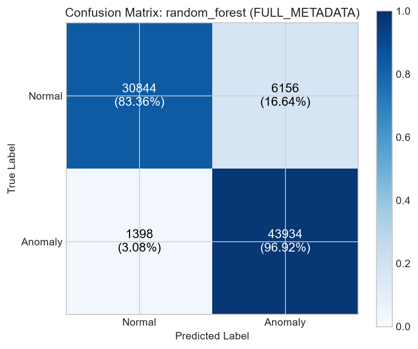
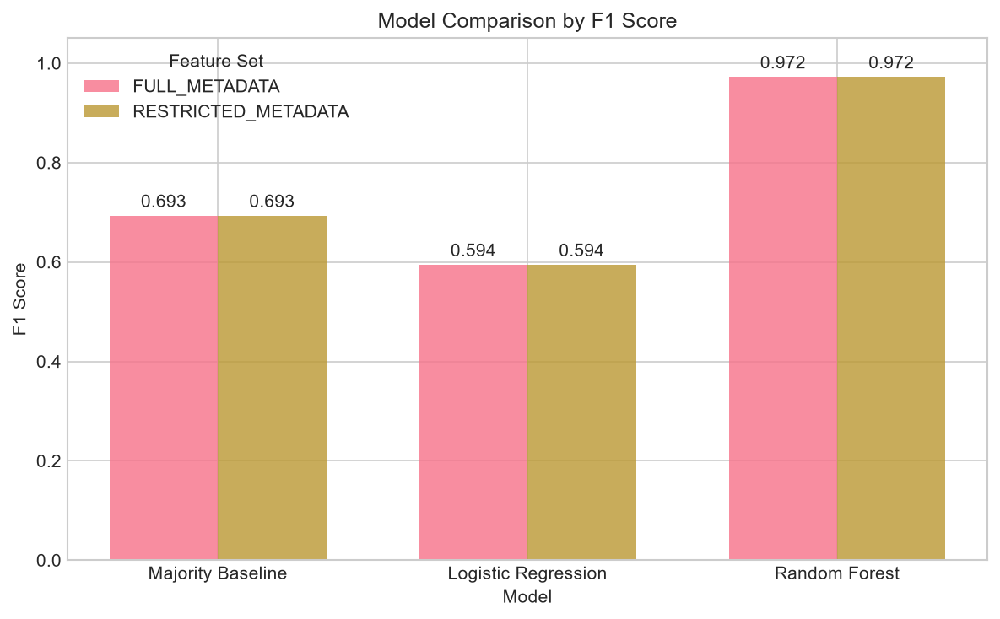
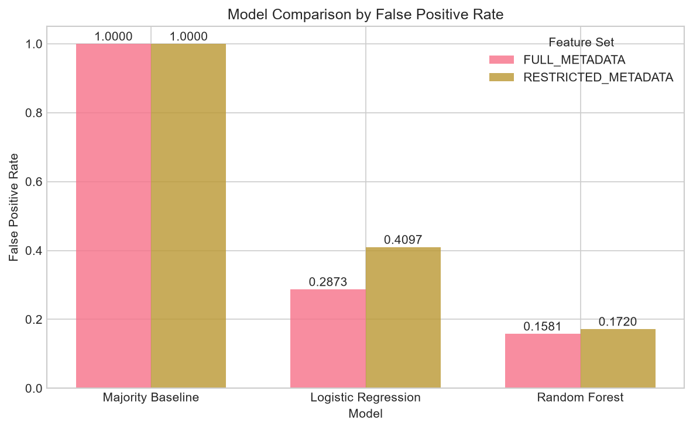
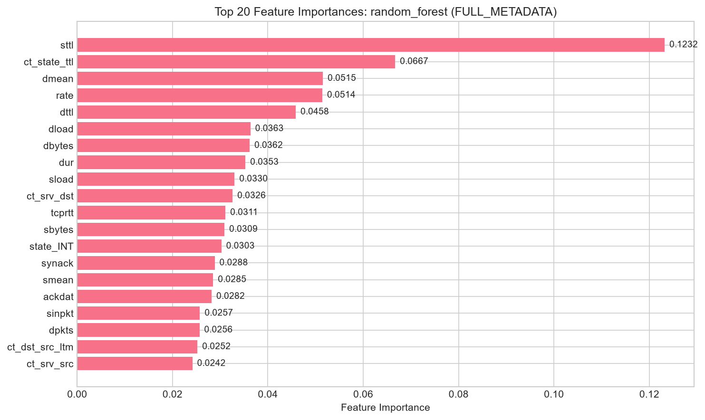
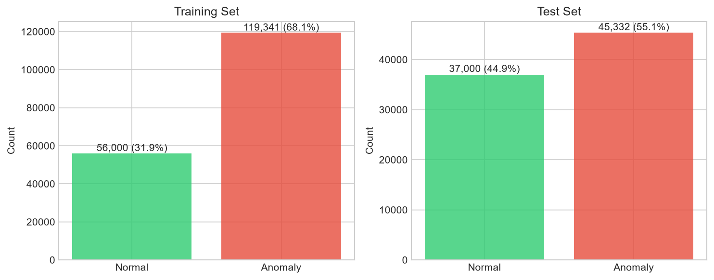

# Privacy-Preserving Network Anomaly Detection

Detecting abnormal network behavior from traffic metadata alone - flow statistics, packet headers and connection behavior - without reading packet payloads. The project asks whether that metadata carries enough signal to separate normal traffic from attacks, and how much is lost when the feature set is cut down to a small core of flow statistics.

All experiments use the official UNSW-NB15 train/test split (175,341 / 82,332 rows), never a random re-split of the combined data.

## Research questions

**Primary:** Can network traffic metadata provide enough information to detect abnormal network behavior without inspecting packet payload contents?

**Secondary:** How much detection performance changes when the detector is restricted to a smaller subset of traffic metadata?

**Hypothesis:** Metadata (duration, counts, byte volumes, timing, TCP state, protocol behavior) contains real signal for anomaly detection, and a small core subset of it keeps most of that signal while giving up some performance.

> Metadata-only monitoring is not a formal privacy guarantee. The project studies payload-free detection, not complete traffic privacy.

## Why I Chose This Question

I chose this question because it sits where the areas I want to work in overlap: cybersecurity, machine learning, networking and statistical analysis. I also wanted something that solves a real technical problem rather than only demonstrating a machine-learning model on tidy data.

The problem is easy to state. Encryption protects the contents of network traffic, but monitoring still has to identify suspicious behavior. When payload contents are unavailable - the normal situation on today's encrypted connections - the detector is left with things like flow duration, packet counts, packet sizes, timing and connection behavior. The question is whether that is enough.

That led me to the main question, which I formulated myself for this project rather than taking it from a paper:

> Can network traffic metadata provide enough information to detect abnormal network behavior without inspecting packet payload contents?

The direction behind it is an established research area - machine-learning-based encrypted traffic analysis and network anomaly detection - not something I invented. Two works that shaped my view of the field are the IEEE survey [Machine Learning-Powered Encrypted Network Traffic Analysis: A Comprehensive Survey](https://doi.org/10.1109/COMST.2022.3208196), which reviews how machine learning extracts useful information from encrypted traffic without touching payloads, and a 2025 Scientific Reports paper, [Anomaly detection in encrypted network traffic using self-supervised learning](https://doi.org/10.1038/s41598-025-08568-0), which detects anomalies from flow-level statistical features and evaluates on UNSW-NB15 among other datasets.

What this project contributes is a controlled and reproducible experiment built on that direction: a written metadata-only feature policy, strict leakage prevention, the official UNSW-NB15 train/test split, and a comparison between `FULL_METADATA` and `RESTRICTED_METADATA`. To be clear about scope - the project does not claim to invent a new machine-learning algorithm. The models are deliberately ordinary baselines. The purpose is to measure how much useful detection signal remains when the detector is limited to traffic metadata and cannot inspect payload contents.

## Why this matters

Encryption is now the default on the internet: TLS 1.3, QUIC and encrypted DNS leave content invisible on the wire. Defenders still need to find scanning, denial-of-service, exploitation and command-and-control traffic, but the classic answer - deep packet inspection - either stops working or requires breaking encryption. The alternative is to work only with what is still visible: flow records, packet headers, timing and connection state. Those are exactly what a NetFlow or IPFIX exporter produces. This project is a reproducible baseline for that idea: it measures how far payload-free detection gets you on a standard public dataset, under a written feature policy that can be audited.

## Threat model

- **Defender:** sees traffic metadata only (headers, flow records, timing). Never decrypts or parses payload.
- **Attacker:** generates malicious traffic and may encrypt, obfuscate or imitate legitimate flows.
- **Assumption:** an attacker cannot perfectly match the statistical profile of benign traffic across every metadata dimension simultaneously - the detection premise this experiment tests on UNSW-NB15.

## What the system does

1. Verifies which dataset is present in `data/raw/` and says so out loud (research split vs development sample).
2. Validates schema, targets and feature policy before anything is trained.
3. Preprocesses both feature sets with statistics fitted on the training split only.
4. Trains three baselines per feature set with a fixed seed.
5. Evaluates on the official held-out test split and writes metrics, figures and a PDF report.

## What information it uses

Only traffic metadata: flow duration, packet and byte counts, rates, packet-size statistics, inter-arrival timing and jitter, TCP timing and window fields, protocol / service / connection state, and connection-count aggregates. The per-field reasoning is in [docs/feature_policy.md](docs/feature_policy.md), generated from [`src/privacy_preserving_nad/features/build_features.py`](src/privacy_preserving_nad/features/build_features.py).

## What it intentionally does not use

| Excluded | Reason |
|---|---|
| `srcip`, `dstip` | IP addresses are identity-bearing and do not generalize |
| `sport`, `dsport` | raw ports are identity-bearing; only port-derived *counts* are allowed |
| `Stime`, `Ltime` | absolute timestamps enable cross-flow tracking |
| `label`, `attack_cat`, `id` | labels and row indices - target leakage, never features |
| `trans_depth`, `response_body_len`, `is_ftp_login`, `ct_ftp_cmd`, `ct_flw_http_mthd` | these exist only because the capture tooling parsed HTTP/FTP content; with encrypted transports they are invisible, so keeping them would make the payload-free claim false |
| any payload or content field | by definition |

A leakage guard enforces this at feature-selection time and fails the run if a forbidden name appears in a feature set (`tests/test_leakage.py`).

## Dataset

**UNSW-NB15** (Australian Centre for Cyber Security, 2015): real normal traffic mixed with synthetic attack traffic across DoS, exploits, fuzzers, reconnaissance, shellcode, worms, backdoors and generic categories.

| Split | Rows | Classes |
|---|---:|---|
| Training | 175,341 | 56,000 normal / 119,341 anomalous |
| Testing | 82,332 | 37,000 normal / 45,332 anomalous |

45 columns per file: a row id, 42 traffic fields, `attack_cat`, and the binary `label` (0 = normal, 1 = anomalous) used as the target.

The repository distinguishes two things that share these filenames:

- **Research dataset** - the official split above, verified by row count and sha256 (`configs/config.yaml` records both checksums). This is the only input that produces benchmark results.
- **Development sample** - synthetic rows written by `scripts/create_sample_data.py` for tests and CI. The pipeline detects it, labels the run a smoke test, and never presents it as UNSW-NB15 results. It refuses to overwrite the research dataset.

Getting the official files:

```bash
python -m privacy_preserving_nad.data.download            # status + instructions
python -m privacy_preserving_nad.data.download --fetch    # download, sha256-verify
```

or download manually from the [official UNSW page](https://research.unsw.edu.au/projects/unsw-nb15-dataset) and place `UNSW_NB15_training-set.csv` and `UNSW_NB15_testing-set.csv` in `data/raw/`. Raw and processed data are gitignored; no dataset file is committed.

## Feature policy

Feature definitions live in configuration ([`configs/config.yaml`](configs/config.yaml)), not scattered through the code:

| Feature set | Selected features | After encoding | Contents |
|---|---:|---:|---|
| `FULL_METADATA` | 37 | 189 columns | all policy-compliant metadata |
| `RESTRICTED_METADATA` | 17 | 17 columns | basic flow statistics and timing only |

`FULL_METADATA` = duration, packet/byte counts, rates, TTLs, loss, inter-arrival times, jitter, TCP windows and sequence bases, TCP timing (`tcprtt`, `synack`, `ackdat`), mean packet sizes, nine connection-count aggregates, plus `proto` / `service` / `state`.

`RESTRICTED_METADATA` = `dur`, `spkts`, `dpkts`, `sbytes`, `dbytes`, `rate`, `sttl`, `dttl`, `sload`, `dload`, `sinpkt`, `dinpkt`, `sjit`, `djit`, `tcprtt`, `synack`, `ackdat`.

Two fields deserve honest notes: `ct_*_dport/sport` and `is_sm_ips_ports` are aggregate counts *keyed on* addresses and ports - the raw addresses and ports never enter the model. `tcprtt`, `synack` and `ackdat` assume a visible TCP handshake, which encrypted transports still expose.

## Methodology

- **Split:** the official UNSW-NB15 train/test files, used as released. Rows are never merged across the split, never shuffled, never re-partitioned.
- **Cleaning:** no rows are dropped. The official files contain zero missing values and zero duplicates (verified by the validator). If a file ever had missing values, imputation happens inside the sklearn pipeline.
- **Preprocessing:** numeric columns are median-imputed and standardized; `proto`, `service`, `state` are one-hot encoded with `handle_unknown='ignore'`. Every statistic is fitted on the training split only, then applied to the test split - the test split never contributes to imputation, scaling or vocabulary.
- **Seed:** 42 for numpy, Python's `random` and every estimator.
- **Models:** majority-class baseline (DummyClassifier); Logistic Regression (`C=1.0`, `max_iter=1000`, `lbfgs`, `class_weight='balanced'`); Random Forest (200 trees, `max_depth=15`, `min_samples_split=5`, `min_samples_leaf=2`, `class_weight='balanced'`). Deliberately simple baselines - no tuning, no architecture search.
- **Target:** `label` cast to binary, 0 = normal, 1 = anomalous. Values outside {0,1} abort the run.
- **Threshold:** default 0.5 for both models; nothing is tuned against the test set.
- **Metrics:** precision, recall, F1, false positive rate, false negative rate, confusion matrix, ROC AUC, PR AUC, and per-class sample counts.
- **Class imbalance:** anomalous is the majority class in both splits (68% train, 55% test), which is why the majority baseline scores a deceptively high F1 - the reading guide in the results section handles this.

## Experiments

Five training runs, one validation step:

| # | Model | Feature set |
|---|---|---|
| 1 | Majority baseline | (feature-independent; reported for both sets) |
| 2 | Logistic Regression | `FULL_METADATA` |
| 3 | Random Forest | `FULL_METADATA` |
| 4 | Logistic Regression | `RESTRICTED_METADATA` |
| 5 | Random Forest | `RESTRICTED_METADATA` |

## Results

<!-- BEGIN GENERATED RESULTS -->

**Experiment status: research run.** Official UNSW-NB15 split as released - 175,341 training rows and 82,332 test rows, verified against recorded sha256 checksums. The official split is used as-is: no rows are merged, shuffled or re-split, and no hyperparameter or threshold was chosen against the test set.

### Main comparison

| Feature set | Model | Precision | Recall | F1 | FPR | FNR |
|---|---|---:|---:|---:|---:|---:|
| FULL_METADATA | Majority baseline | 0.5506 | 1.0000 | 0.7102 | 1.0000 | 0.0000 |
| FULL_METADATA | Logistic Regression | 0.8003 | 0.9399 | 0.8645 | 0.2873 | 0.0601 |
| FULL_METADATA | Random Forest | 0.8771 | 0.9692 | 0.9208 | 0.1664 | 0.0308 |
| RESTRICTED_METADATA | Majority baseline | 0.5506 | 1.0000 | 0.7102 | 1.0000 | 0.0000 |
| RESTRICTED_METADATA | Logistic Regression | 0.7319 | 0.9131 | 0.8125 | 0.4097 | 0.0869 |
| RESTRICTED_METADATA | Random Forest | 0.8663 | 0.9536 | 0.9078 | 0.1804 | 0.0464 |

### Reading the table

**Class balance.** The test split holds 82,332 flows: 37,000 normal (44.9%) and 45,332 anomalous (55.1%). The anomaly class is the majority here, so always answering 'anomalous' gives the majority baseline an F1 of 0.7102 while flagging every normal flow as malicious (FPR 1.0000). That is the floor both models had to clear, and both cleared it.

**Best result of this run: Random Forest (FULL_METADATA)**, F1 0.9208 (precision 0.8771, recall 0.9692). In counts: it caught 43,934 of 45,332 anomalous flows and missed 1,398 (3.1% false negatives), while flagging 6,156 of 37,000 normal flows as attacks (16.6% false positives). In an operational setting that false-positive column is the price of the recall.

**Effect of the restricted feature set (37 -> 17 features).** Random Forest moved from F1 0.9208 to 0.9078 (-0.0130) and its false-positive rate from 0.1664 to 0.1804. Logistic Regression moved from F1 0.8645 to 0.8125 (-0.0520) with its false-positive rate from 0.2873 to 0.4097. On this run the tree model gave up little when the feature set was cut down while the linear model lost more ground - the extra features helped the model that can exploit interactions more than the one that cannot.

**Precision-recall posture.** Recall on the full set was 0.9399 for logistic regression and 0.9692 for the forest - most anomalous flows detected - at false-positive rates of 0.2873 and 0.1664 respectively. class_weight='balanced' pushes models toward recall under this class distribution; a deployment would pick an operating threshold to trade some recall for fewer false alarms. This experiment used the default 0.5 threshold and did not tune anything against the test set.

**Scope.** 4 model/feature-set combinations were trained and evaluated on this single dataset and split. The ranking above describes this run only - it is not a claim that any model is generally superior, and no claim of privacy, production readiness or adversarial robustness follows from it.

This block is generated from `results/metrics/evaluation_results.json` by `python scripts/render_results.py`; the pipeline plus that script reproduce it exactly.

<!-- END GENERATED RESULTS -->

### Figures

Confusion matrix, Random Forest on `FULL_METADATA`:



Model comparison by F1:



Model comparison by false positive rate:



Feature importance, Random Forest on `FULL_METADATA`:



Class distribution of the official split:



The numbers above come from `results/metrics/evaluation_results.json`; refresh them with:

```bash
python -m privacy_preserving_nad.pipeline
python scripts/render_results.py
```

## Limitations

1. **Dataset age.** UNSW-NB15 is from 2015 and predates widespread TLS 1.3, QUIC and encrypted SNI; modern traffic looks different.
2. **Synthetic attacks.** The attack traffic was generated in a lab. It does not reproduce a determined human adversary, and the train/test split is dataset-internal rather than a capture from a production network.
3. **Distribution shift.** Any deployment will see traffic distributions this dataset does not contain.
4. **Feature availability.** Some selected fields assume a vantage point that sees the TCP handshake and enough packets per flow for timing statistics; short or sampled flows would provide weaker versions of them.
5. **Binary simplification.** Nine attack categories are collapsed into one anomaly class; per-attack behavior is not reported.
6. **Single threshold, no tuning.** Results are at the default 0.5 decision threshold; they are one point on the precision-recall curve, not an optimized operating point.
7. **Scope of the privacy claim.** The experiment shows payload-free *detection*. Metadata alone can still fingerprint and profile users, and nothing here is a formal privacy guarantee, a production system, or evidence of robustness against evasion.

## Reproduction

```bash
git clone https://github.com/TMStroo/Privacy-Preserving-Network-Anomaly-Detection
cd Privacy-Preserving-Network-Anomaly-Detection
pip install -r requirements.txt
pip install -e .

python -m privacy_preserving_nad.data.download --fetch   # official split into data/raw/
python -m privacy_preserving_nad.pipeline                # full experiment
python scripts/render_results.py                         # refresh README results
python -m pytest tests/ -v                               # test suite
```

Without the research dataset, the pipeline still runs on a development sample and says so on screen and in `results/metrics/dataset_info.json`. CI works the same way - it never downloads the full dataset.

Individual stages: `python -m privacy_preserving_nad.pipeline --step validate|preprocess|train|evaluate|plot`. PDF report: `python scripts/generate_report.py` writes [docs/project_report.pdf](docs/project_report.pdf) from the current `results/`.

## Project structure

```
configs/config.yaml          dataset paths, feature sets, seeds, model parameters
data/raw/                    dataset files (gitignored)
data/processed/              transformed splits (gitignored)
docs/feature_policy.md       per-feature policy table (generated)
docs/project_report.pdf      full project report (generated)
notebooks/                   exploratory analysis
results/metrics/             JSON/CSV metrics, dataset info (tracked)
results/figures/             generated plots (tracked)
results/models/              trained model files (gitignored)
scripts/create_sample_data.py   development sample generator
scripts/render_results.py       README results renderer
scripts/generate_report.py      PDF report generator
src/privacy_preserving_nad/
  data/                      download, detect, validate, preprocess
  features/                  feature policy definitions and documentation
  models/                    baselines, training, inference
  evaluation/                metrics and plots
  pipeline.py                orchestration
tests/                       53 tests, including leakage guards
.github/workflows/ci.yml     tests + sample-data pipeline check
```

## Future research directions

- Run the same policy against newer captures (CIC-IDS2017, CIC-DoS2019) to test transfer.
- Adversarial evaluation: how far can metadata be shuffled before detection breaks?
- Per-attack-category results instead of binary detection.
- Threshold selection for a target false-positive budget rather than fixed 0.5.
- Concept drift of metadata statistics over time.
- Deployment as a NetFlow/IPFIX consumer on a live mirror port.

## License

MIT - see [LICENSE](LICENSE).

## Citation

```bibtex
@misc{privacy-preserving-nad,
  title={Privacy-Preserving Network Anomaly Detection},
  author={TMStroo},
  year={2026},
  url={https://github.com/TMStroo/Privacy-Preserving-Network-Anomaly-Detection}
}
```
